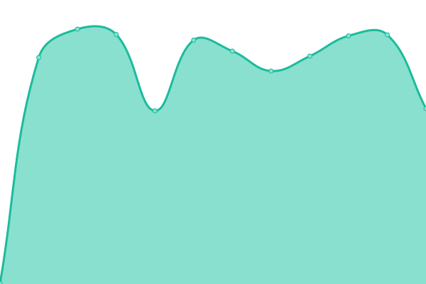
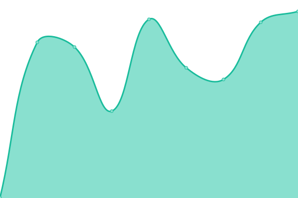
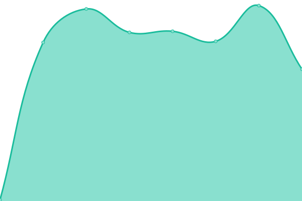
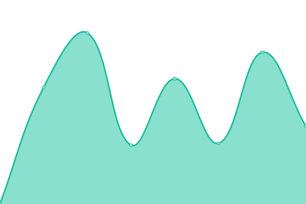

# [📈 Live Status](https://learnasteve.github.io/korero-upptime): <!--live status--> **🟧 Partial outage**

This repository contains the open-source uptime monitor and status page for [learnasteve](https://learnasteve.github.io/korero-upptime), powered by [Upptime](https://github.com/upptime/upptime).

With [Upptime](https://upptime.js.org), you can get your own unlimited and free uptime monitor and status page, powered entirely by a GitHub repository. We use [Issues](https://github.com/learnasteve/korero-upptime/issues) as incident reports, [Actions](https://github.com/learnasteve/korero-upptime/actions) as uptime monitors, and [Pages](https://learnasteve.github.io/korero-upptime) for the status page.

<!--start: status pages-->
<!-- This summary is generated by Upptime (https://github.com/upptime/upptime) -->
<!-- Do not edit this manually, your changes will be overwritten -->
<!-- prettier-ignore -->
| URL | Status | History | Response Time | Uptime |
| --- | ------ | ------- | ------------- | ------ |
|  [Polly (app)](https://lab.let.media.kyoto-u.ac.jp/korero/polly/health) | 🟩 Up | [polly-app.yml](https://github.com/learnasteve/korero-upptime/commits/HEAD/history/polly-app.yml) | 

 704ms
     
 | 

<a href="https://learnasteve.github.io/korero-upptime/history/polly-app">100.00%</a>
    

|  [Tammy (app)](https://lab.let.media.kyoto-u.ac.jp/korero/tammy/health) | 🟩 Up | [tammy-app.yml](https://github.com/learnasteve/korero-upptime/commits/HEAD/history/tammy-app.yml) | 

 147ms
     
 | 

<a href="https://learnasteve.github.io/korero-upptime/history/tammy-app">100.00%</a>
    

|  [Tammy (llm)](https://lab.let.media.kyoto-u.ac.jp/korero/tammy/health/llm) | 🟩 Up | [tammy-llm.yml](https://github.com/learnasteve/korero-upptime/commits/HEAD/history/tammy-llm.yml) | 

 1136ms
     
 | 

<a href="https://learnasteve.github.io/korero-upptime/history/tammy-llm">100.00%</a>
    

|  [Penny (app)](https://lab.let.media.kyoto-u.ac.jp/korero/penny/health) | 🟩 Up | [penny-app.yml](https://github.com/learnasteve/korero-upptime/commits/HEAD/history/penny-app.yml) | 

 147ms
     
 | 

<a href="https://learnasteve.github.io/korero-upptime/history/penny-app">100.00%</a>
    

|  [Penny (llm)](https://lab.let.media.kyoto-u.ac.jp/korero/penny/health/llm) | 🟩 Up | [penny-llm.yml](https://github.com/learnasteve/korero-upptime/commits/HEAD/history/penny-llm.yml) | 

 1238ms
     
 | 

<a href="https://learnasteve.github.io/korero-upptime/history/penny-llm">100.00%</a>
    

|  [Archie (app)](https://lab.let.media.kyoto-u.ac.jp/korero/archie/health) | 🟩 Up | [archie-app.yml](https://github.com/learnasteve/korero-upptime/commits/HEAD/history/archie-app.yml) | 

 147ms
     
 | 

<a href="https://learnasteve.github.io/korero-upptime/history/archie-app">100.00%</a>
    

|  [Percy (app)](https://lab.let.media.kyoto-u.ac.jp/korero/percy/health) | 🟩 Up | [percy-app.yml](https://github.com/learnasteve/korero-upptime/commits/HEAD/history/percy-app.yml) | 

 147ms
     
 | 

<a href="https://learnasteve.github.io/korero-upptime/history/percy-app">100.00%</a>
    

|  [Debbie (app)](https://lab.let.media.kyoto-u.ac.jp/korero/debbie/health) | 🟩 Up | [debbie-app.yml](https://github.com/learnasteve/korero-upptime/commits/HEAD/history/debbie-app.yml) | 

 147ms
     
 | 

<a href="https://learnasteve.github.io/korero-upptime/history/debbie-app">100.00%</a>
    

|  [Rex (app)](https://lab.let.media.kyoto-u.ac.jp/korero/rex/health) | 🟩 Up | [rex-app.yml](https://github.com/learnasteve/korero-upptime/commits/HEAD/history/rex-app.yml) | 

 147ms
     
 | 

<a href="https://learnasteve.github.io/korero-upptime/history/rex-app">100.00%</a>
    

|  [Huanui (login)](https://lab.let.media.kyoto-u.ac.jp/korero/alive) | 🟩 Up | [huanui-login.yml](https://github.com/learnasteve/korero-upptime/commits/HEAD/history/huanui-login.yml) | 

 147ms
     
 | 

<a href="https://learnasteve.github.io/korero-upptime/history/huanui-login">100.00%</a>
    

|  [Uranga (dashboard)](https://lab.let.media.kyoto-u.ac.jp/korero/uranga/health) | 🟥 Down | [uranga-dashboard.yml](https://github.com/learnasteve/korero-upptime/commits/HEAD/history/uranga-dashboard.yml) | 

 149ms
     
 | 

<a href="https://learnasteve.github.io/korero-upptime/history/uranga-dashboard">100.00%</a>
    

|  [Uranga (db)](https://lab.let.media.kyoto-u.ac.jp/korero/uranga/health/db) | 🟥 Down | [uranga-db.yml](https://github.com/learnasteve/korero-upptime/commits/HEAD/history/uranga-db.yml) | 

 146ms
     
 | 

<a href="https://learnasteve.github.io/korero-upptime/history/uranga-db">100.00%</a>
    

<!--end: status pages-->

[**Visit our status website →**](https://learnasteve.github.io/korero-upptime)

## 📄 License

- Powered by: [Upptime](https://github.com/upptime/upptime)
- Code: [MIT](./LICENSE) © [Anand Chowdhary](https://anandchowdhary.com), supported by [Pabio](https://pabio.com)
- Data in the `./history` directory: [Open Database License](https://opendatacommons.org/licenses/odbl/1-0/)
